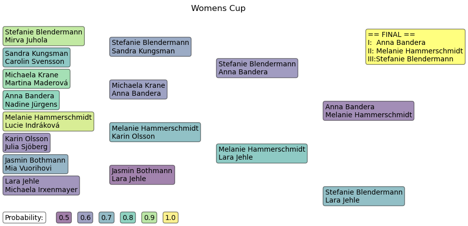
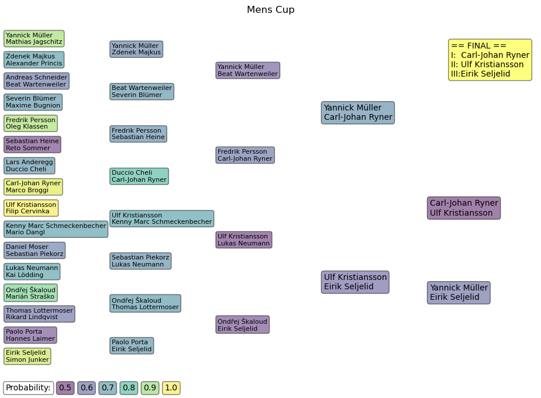
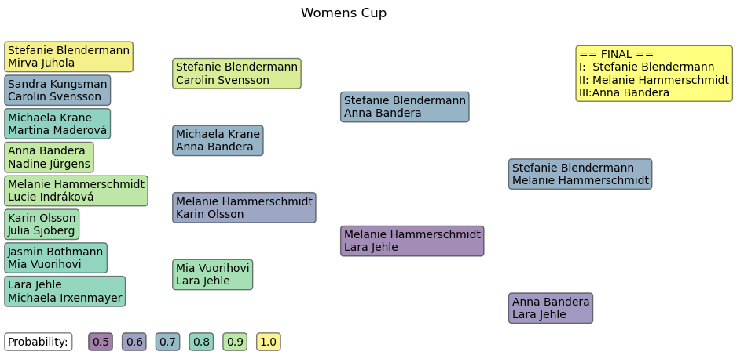
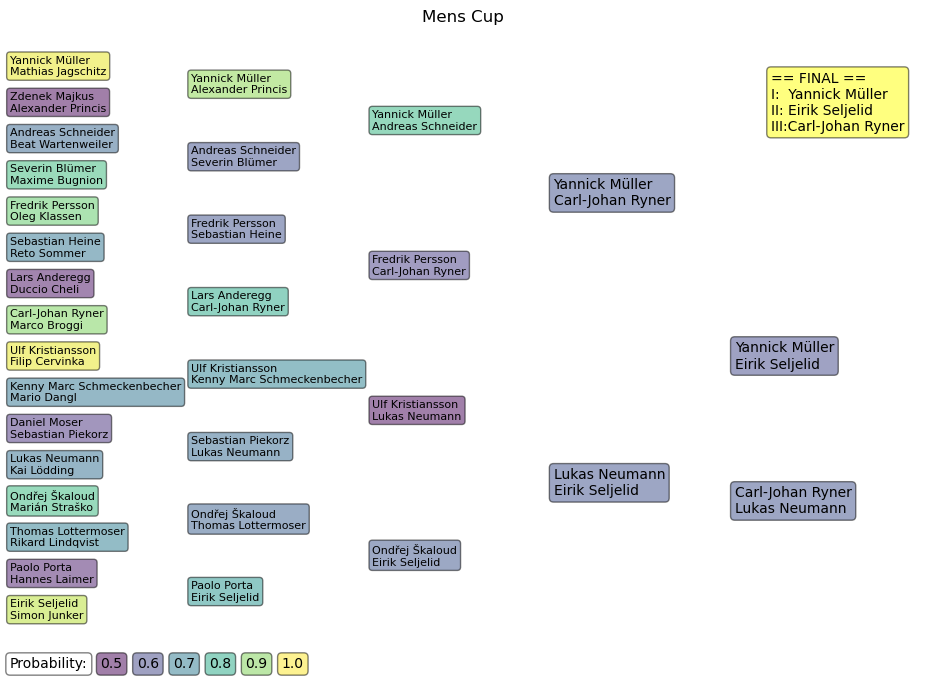

# WMC_2023_CUP

## Monte carlo simulations of the cup finals
Axel Ekman

For earlier introduction, please refer to The analysis of [WMC 2017](https://github.com/axarekma/WMC_2017_CUP)

- I parsed the standings 23/08.
- Cup is now played on all lanes
- Starting lanes are from the old bracket

Shown here are MC siumulations of the brackets and the probability of the winner.

## Correct Lanes
### Womens cup as of 24/08

### Mens cup as of 24/08

## Old result (all lanes)
### Womens cup as of 24/08

### Mens cup as of 24/08
