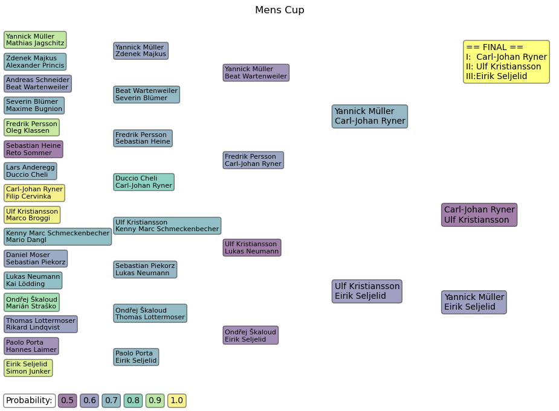

# WMC_2023_CUP

## Monte carlo simulations of the cup finals
Axel Ekman

For earlier introduction, please refer to The analysis of [WMC 2017](https://github.com/axarekma/WMC_2017_CUP)

### Hot takes
The most probably winner of the women is Melanie Hammerschmidt winning gold 32/100 times but the most probable bracket outcome has the podium as 
1. Melanie Hammerschmidt
2. Anna Bandera 
3. Stefanie Blendermann.

World champion Stefanie Blendermann is surprisingly an underdog in both matches.

The monte carlo simulation of the bracket points to a nailbiter of a finish where the modal value has Ulf winning 4-3, with CJ still being the predicted winner.

## Most Common Medalists
The most common medalists is counted from 10000 realizations of a MC bracket. Numbers shown are normalized to 100. 

I.e., if we were to rerun the bracket 100 times, Melanie is expected to win 32 times, and be on the podium a total of 67 times.

The lanes were not in favour of Yannick Müller, dropping him from second place to the 7th most likely winner.

#### Womens CUP
| Player                |   Gold |   Silver |   Bronze |
|:----------------------|-------:|---------:|---------:|
| Melanie Hammerschmidt |     32 |       25 |       10 |
| Anna Bandera          |     20 |       12 |       14 |
| Stefanie Blendermann  |     17 |       14 |       20 |
| Michaela Krane        |      9 |       10 |       12 |
| Sandra Kungsman       |      6 |        8 |       10 |
| Jasmin Bothmann       |      4 |        7 |        9 |
| Karin Olsson          |      4 |        7 |        3 |
| Lara Jehle            |      3 |        7 |        8 |
| Michaela Irxenmayer   |      2 |        4 |        5 |
| Julia Sjöberg         |      1 |        3 |        1 |
| Carolin Svensson      |      1 |        1 |        2 |

#### Mens Cup
| Player                     |   Gold |   Silver |   Bronze |
|:---------------------------|-------:|---------:|---------:|
| Carl-Johan Ryner           |     24 |       17 |        9 |
| Ulf Kristiansson           |     19 |       12 |       12 |
| Eirik Seljelid             |     11 |       10 |       13 |
| Fredrik Persson            |     10 |        9 |        5 |
| Ondřej Škaloud             |      9 |        8 |       11 |
| Lukas Neumann              |      9 |        8 |        8 |
| Yannick Müller             |      7 |        9 |       12 |
| Beat Wartenweiler          |      3 |        5 |        6 |
| Zdenek Majkus              |      1 |        3 |        4 |
| Kenny Marc Schmeckenbecher |      1 |        2 |        2 |
| Sebastian Piekorz          |      1 |        2 |        2 |
| Paolo Porta                |      1 |        2 |        2 |
| Sebastian Heine            |      1 |        2 |        1 |

## Bracket with match probabilities
Here each match is played 10000 times. The Color of the box indicates the probability of the winner.

Here are the most probable outcome of the whole bracket.

